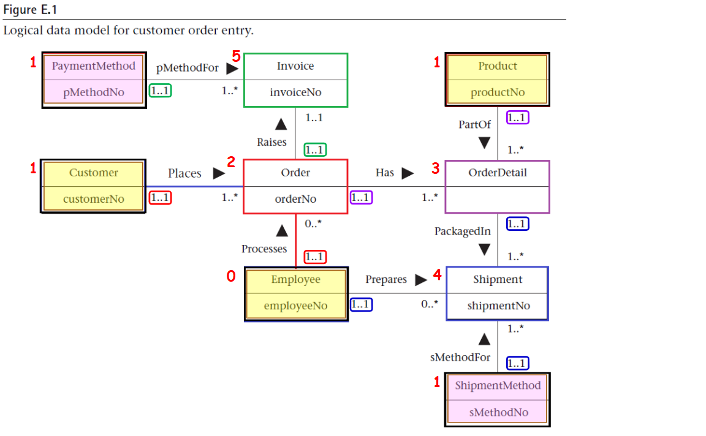

------------------------------------
## 說明

---
###  申請 O1001

- 借用者 吳老師 於 2025-05-01 提交申請，借用：
- BGC513 教室
- 借用時間: 2025-05-01-10:00
- 歸還時間: 2025-05-01-12:00
- 審核者：管理員
- 借用情況：
- 2025-05-01-10:00， BGC513 教室 已由 吳老師 至 系辦 取走借用 鑰匙
- 2025-05-01-12:00， BGC513 教室 已由 吳老師 至 系辦 歸還借用 鑰匙
---
###  申請 O1002

- 借用者 李老師 於 2025-04-30 提交申請，借用：
- BGC614 教室
- 借用時間: 2025-05-01-08:00
- 歸還時間: 2025-05-01-11:00
- 審核者：管理員
- 借用情況：
- 2025-05-01-10:00， BGC614 教室 已由 李老師 至 系辦 取走借用 鑰匙
- 2025-05-01-12:00， BGC614 教室 已由 李老師 至 系辦 歸還借用 鑰匙
---
###  申請 O1003

- 借用者 李老師 於 2025-04-30 提交申請，借用：
- BGC601 教室
- 借用時間: 2025-05-01-08:00
- 歸還時間: 2025-05-01-11:00
- 審核者：管理員
- 借用情況：
- 2025-05-01-10:00， BGC601 教室 已由 李老師 至 系辦 取走借用 鑰匙
- 2025-05-01-12:00， BGC601 教室 已由 李老師 至 系辦 歸還借用 鑰匙
---
### 申請 O1004

- 借用者 張老師 於 2025-05-02 提交申請，借用：
- BGC501 教室
- 借用時間: 2025-05-03-09:00
- 歸還時間: 2025-05-03-11:00
- 審核者：管理員
- 借用情況：
- 2025-05-03-09:00， BGC501 教室 已由 張老師 至 系辦 取走借用 鑰匙
- 2025-05-03-11:00， BGC501 教室 已由 張老師 至 系辦 歸還借用 鑰匙
---

### 申請 O1005

- 借用者 吳老師 於 2025-05-02 提交申請，借用：
- BGC614 教室
- 借用時間: 2025-05-04-14:00
- 歸還時間: 2025-05-04-16:00
- 審核者：管理員
- 借用情況：
- 2025-05-04-14:00， BGC614 教室 已由 吳老師 至 系辦 取走借用 鑰匙
- 2025-05-04-16:00， BGC614 教室 已由 吳老師 至 系辦 歸還借用 鑰匙
---

### 申請 O1006

- 借用者 陳老師 於 2025-05-03 提交申請，借用：
- BGC601 教室
- 借用時間: 2025-05-05-13:00
- 歸還時間: 2025-05-05-15:00
- 審核者：管理員
- 借用情況：
- 2025-05-05-13:00， BGC601 教室 已由 陳老師 至 系辦 取走借用 鑰匙
- 2025-05-05-15:00， BGC601 教室 已由 陳老師 至 系辦 歸還借用 鑰匙
---

### 申請 O1007

- 借用者 李老師 於 2025-05-04 提交申請，借用：
- BGC513 教室
- 借用時間: 2025-05-06-10:00
- 歸還時間: 2025-05-06-12:00
- 審核者：管理員
- 借用情況：
- 2025-05-06-10:00， BGC513 教室 已由 李老師 至 系辦 取走借用 鑰匙
- 2025-05-06-12:00， BGC513 教室 已由 李老師 至 系辦 歸還借用 鑰匙
---

### 申請 O1008

- 借用者 陳老師 於 2025-05-04 提交申請，借用：
- BGC501 教室
- 借用時間: 2025-05-07-08:30
- 歸還時間: 2025-05-07-10:30
- 審核者：管理員
- 借用情況：
- 2025-05-07-08:30， BGC501 教室 已由 陳老師 至 系辦 取走借用 鑰匙
- 2025-05-07-10:30， BGC501 教室 已由 陳老師 至 系辦 歸還借用 鑰匙
---

### 教師資料 (Employee)

| employeeNo   | firstName   |   workTelExt |       TelNo | empEmailAddress   |
|:-------------:|:-------------:|:-------------:|:----------:|:-----------------:|
| E001      | 吳哲偉        |         1001 |   0900000000 | 13@.nfu.edu.tw   |
| E002      | 李鎮宇        |         1002 |   0912121212 | 16@.nfu.edu.tw   |
| E003      | 林致均        |         1003 |   0911111111 | 22@.nfu.edu.tw   |
| E004      | 陳亮祐        |         1004 |   0912345678 | 35@.nfu.edu.tw   |

### 教室資料 ()

| No   | Number of computers   |   Capacity |Power related equipment|
|:-------------:|:------------------:|:-------------:|:-------------:|
| BGC501      | 30        |         60 |30     |
| BGC513      | 60        |         70 |0   |
| BGC601      | 60        |         60 |0   |
| BGC614      | 0         |         70 |0   |

### 申請資料 ()

| No   |Borrower    |Borrow classroom   | borrow time   |   return time |status|
|:-------------:|:------------------:|:-------------:|:-------------:|:-------------:|:-------------:|
| O1001      | 吳老師   | BGC513   | 2025-05-01-10:00     | 2025-05-01-12:00     | 已歸還   |
| O1002      | 李老師   | BGC614   | 2025-05-01-08:00     | 2025-05-01-11:00     | 已歸還   |
| O1003      | 李老師   | BGC601   | 2025-05-01-08:00     | 2025-05-01-11:00     | 已歸還   |
| O1004      | 吳老師   | BGC501   | 2025-05-02-09:00     | 2025-05-02-11:00     | 已歸還   |
| O1005      | 陳老師   | BGC513   | 2025-05-02-13:00     | 2025-05-02-15:00     | 未歸還   |
| O1006      | 李老師   | BGC614   | 2025-05-03-14:00     | 2025-05-03-16:00     | 已歸還   |
| O1007      | 張老師   | BGC601   | 2025-05-03-08:00     | 2025-05-03-10:00     | 已歸還   |
| O1008      | 吳老師   | BGC501   | 2025-05-04-10:00     | 2025-05-04-12:00     | 未歸還   |
