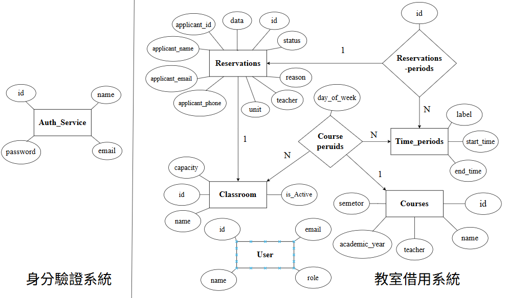
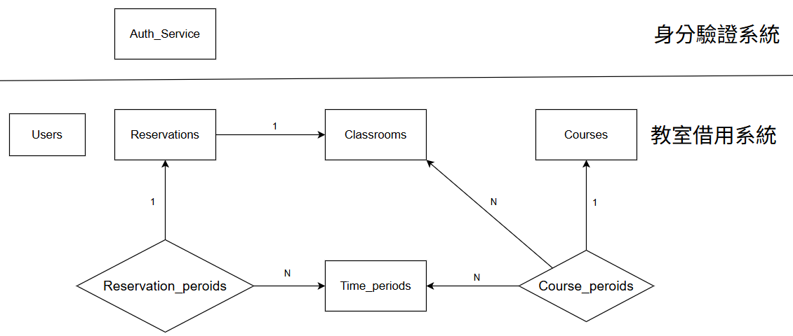
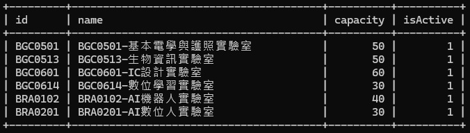
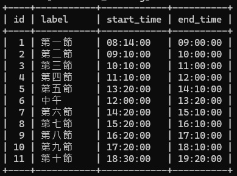
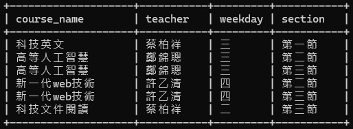
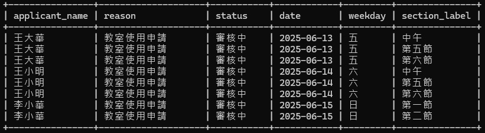
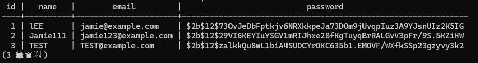

# 教室管理系統（G16）

---

## 🔍 使用者調查（User Research）

1. 借用人申請教室後，無法得知是否已通過申請。
2. 借用人若需更改申請時間，無法進行更改，容易造成重複占用的情況。
3. 管理員希望系統能提供通知功能，讓有借用需求時才進行審核，而不需要每天登入系統檢查。
4. 管理員目前只能新增資料，無法刪除已存在的紀錄。
5. 管理員每學期必須手動對照課表，更新已固定課表的教室借用情況。

---

## 📝 主要設計（Key Design）

- **👤 個人借用申請**
- **🖊️ 課程的自動化借用**

---

## 📎 作業連結

### 作業一：🔗 [前往作業一連結](https://www.canva.com/design/DAGj9WScB2c/eeTuT3zUf8ARXlqzZoK71g/view?utm_content=DAGj9WScB2c&utm_campaign=designshare&utm_medium=link2&utm_source=uniquelinks&utlId=hb68752014d)

### 作業二：🔗 [前往作業二連結](https://www.canva.com/design/DAGj9WScB2c/eeTuT3zUf8ARXlqzZoK71g/view?utm_content=DAGj9WScB2c&utm_campaign=designshare&utm_medium=link2&utm_source=uniquelinks&utlId=hb68752014d)

### 作業三：🔗 [前往作業三連結](https://github.com/leetownrain/DBMS_project_G16/blob/develop/HW3.md)

### 期末簡報：🔗 [前往簡報連結](https://www.canva.com/design/DAGpMgow0HM/g3DIhVA1uYEhztwP-vw_2Q/view?utm_content=DAGpMgow0HM&utm_campaign=designshare&utm_medium=link2&utm_source=uniquelinks&utlId=h9e53976d3b)

### 期末報告：🔗 [前往期末完整報告](Picture/教室管理系統%20G16.pdf)

---

## 🧩 系統簡介

本專題「教室管理系統」是一套具備「教室借用管理」與「使用者身份驗證」功能的 Web 應用系統，旨在提升教室借用流程的效率與透明度，並提供一個操作簡便、具彈性的介面，方便學生、教師與管理員使用。系上教室每日皆有不同的借用需求，除了課表已排定的教室外，也有許多來自個人申請的使用情況。過去多以紙本方式申請，如今系上已經有一個線上借用系統，雖改善了部分便利性，卻仍存在操作不便與功能不足等問題。因此，我們希望重新設計一個更符合實際需求的系統，以提供更流暢、直覺且完善的借用與管理體驗。

系統採用模組化設計，主要拆分為以下兩大核心子系統：

- **🏫 教室借用系統（Classroom Booking System）**
  - 提供教室借用申請、查詢、審核與時段排程等功能。
  - 與 Auth Service 完整整合，依使用者角色授權操作權限。
  - 支援權限分級管理（如：使用者 / 管理員），確保操作安全。
- **🔐 身份驗證系統（Auth Service）**
   - 獨立的使用者註冊、登入與驗證模組。
   - 可作為獨立服務被其他系統整合。
 
---

## 👨‍💻 專案作者

| 姓名 | 學號 | 班級 | 分工 |心得|
|------|------|------|------|------|
| 吳哲瑋 | 41143213 | 四資工三乙 | 整體專案PM、資料庫架構設計、教室借用系統前端設計&後端設計 |資料庫系統這門課，透過課堂的知識了解，再透過專題實作，更讓我認識資料庫的設計，原本還一直不懂關係資料庫是什麼意思，以為就是有多個資料表，PK指向FK，後來，在同學的詢問下，去努力學習，才了解不單單是如此，而是有實體資料表和關係資料表，關係資料表可以連結實體資料表，達到實體資料表和實體資料表建立關係，不額外設計的去儲存資料，也了解好的資料庫設計，必須根據現實的考量，而非一致追求資料庫設計的完美。這次的實作不僅增強我對資料庫的認識，也加強了我在多人協作的經驗，過程雖然不是完美也有拖延，但結果算是好的，之後時間會努力把這個題目做完美，希望可以有實務的應用，或是設計更加複雜的資料庫。|
| 李鎮宇 | 41143216 | 四資工三乙 | 身分驗證系統後端功能開發&資料庫建置 |透過本次課程，我不僅學習到資料庫的設計與實作，也深刻體會到團隊溝通與協作對於專案的重要性，這段經歷讓我對專案流程有了更全面的理解，希望在未來能有機會開發其他資訊系統。|
| 林致均 | 41143222 | 四資工三乙 | 教室借用系統前端設計 |透過這次專題，我不僅加強了資料庫實作能力，更理解團隊合作的重要性。未來如果要開發其他的資訊系統，這次經驗將是一個重要的基礎。|
| 陳亮祐 | 41143235 | 四資工三乙 | 課程爬蟲功能、教室借用系統匯入課程資料後端設計 | 這次的期末專題讓我有機會重新複習課堂上所學的知識，並實際應用在專題製作中。從一開始的討論與分工，到後續遇到問題時不斷修正的過程，不僅加深了我對理論的理解，也累積了寶貴的實作經驗。同時也非常感謝組員們這幾個月來的努力與配合，彼此之間的交流與合作是專題能順利完成的關鍵。這段經歷讓我收穫良多，也更加體會到團隊合作與實踐的重要性。|

---

## 📌 使用案例（Use Cases）

### 使用者：
1. **未登入**
   - 登入、註冊
   - 查看教室使用情況
   - 查看審核狀態
    
2. **學生/老師**
   - 登入、註冊、修改密碼
   - 查看教室使用情況
   - 提出借用申請
   - 查看審核狀態

3. **管理員**
   - 登入、修改密碼
   - 管理教室和時段（新增和修改）
   - 新增每學期的課程使用情況
   - 查看所有借用紀錄
   - 審核教室借用申請
   - 查看教室使用情況

---

## 🌐 應用情境 (使用說明)

| 使用者 | 使用情境說明 |
|-------|-------------|
| 學生 | 小組報告或期末表演前夕，學生臨時需要空教室進行討論與練習。透過系統查詢當天空教室時段後，立即提出借用申請，並經由系統管理員線上核可，即可快速取得使用權，節省來回詢問時間。 | 
| 老師 | 鄭老師想安排一場練習時間或辦理一場專題講座，需要額外教室空間。透過系統登入後，可直接查看適合時段與空間的可用教室，並快速完成申請與公告流程，避免與其他活動衝突。 | 
| 系辦管理員 | 管理員可使用系統後台功能，統一管理每日教室借用申請，審核借用事由是否合理，並可檢視即時教室使用情況、彙整借用紀錄與統計報表，有效提升資源分配與管理效率。 |

---

## 📋 各身份所持有權限

|               | 未登入情況 | 學生 | 教師 | 管理者 |
|---------------|-----------|-----|-----|-------|
| 註冊           | ⭕ | ⭕ | ⭕ | ❌ |
| 登入           | ⭕ | ⭕ | ⭕ | ⭕ |
| 修改密碼        | ❌ | ⭕ | ⭕ | ⭕ |
| 借用           | ❌ | ⭕ | ⭕ | ⭕ |
| 查看教室使用情況 | ⭕ | ⭕ | ⭕ | ⭕ |
| 管理教室和時段   | ❌ | ❌ | ❌ | ⭕ |
| 審核借用        | ❌ | ❌ | ❌ | ⭕ |
| 查看審核狀態     | ⭕ | ⭕ | ⭕ | ⭕ |

---

## 📋 教室資料庫設計圖（ERD）



---

## 📌 關係整理與解釋



- 一筆 **reservation**（借用）對應一間 **classroom**（教室）→ 多對一關係
- 一門 **course**（課程）可對應多個 **time_period**（時段）→ 多對多關係，透過 `course_periods`
- 一筆 **reservation** 可對應多個 **time_period** → 多對多關係，透過 `reservations_periods`
- **course_periods** 額外指定該時段使用的 **classroom**（教室） → 多對一關係

---

## 🏫 教室借用系統（Classroom Booking System）


### 🔷 一、實體資料表（Entities）

### 1. `users` – 使用者資料表

```sql
CREATE TABLE user (
    id VARCHAR(8) PRIMARY KEY,
    username VARCHAR(25) NOT NULL,
    email VARCHAR(50) NOT NULL UNIQUE,
    role ENUM('user', 'admin') NOT NULL,
    is_psd_init BOOLEAN DEFAULT FALSE
);
```

| 欄位名稱 | 資料型別 | 中文說明 | 是否為空值 | 完整性限制 |
|----------|---------|-----------|----|--------------|
| `id`     | string | 使用者編號 | 否 | 主鍵，符合學號或員工編號格式(如後) |
| `name`   | string | 使用者姓名 | 否 | 長度2-25字中文  正規表示式：'^[\u4e00-\u9fa5]{2,25}$' |
| `email`  | string | 電子郵件   | 否 | 唯一性，符合電子郵件格式(如後) |
| `role`   | string | 使用者角色 | 否 | 僅限 'admin' 或 'user' |

**格式說明：**  
- 使用者編號：須為「虎尾科技大學」學生之學號，共 8 碼，或是教師員工號碼，共6碼。  
  學生學號：  
       第一碼　　：學制，如:D為博士、1 為碩士、3 為二技、4 為四技、5 為五專。    
       第二、三碼： 入學學年，如:11 表示 111 年入學。    
       第四、五碼：系所代碼，如:資工四技為 43、資工碩班63。    
       第六碼　　：班級代碼，如:甲班為 1、乙班為 2、攜班為9，依此類推。    
       第七、八碼：學生座號。  
       正規表示式：'^[D1345]\d{2}\d{2}[1-9](?:0[1-9]|[1-9][0-9])$'  
  
  教師員工編號：  
       第一碼　　：職位，如：教師為B，行政人員為E。  
       第二、三碼：系級，如：資工為13，通識教育中心為35等等。  
       第四碼　　：聘任類別，如：專任為0，兼任為P。  
       第五、六碼：個人編碼，如：陳國益為29。  
       正規表示式：'^[A-Z]\d{2}[0P]\d{2}$'   
- 電子郵件：須符合電子郵件標準格式，如：使用者名稱@網域名稱，student123@nfu.edu.tw、user@gmail.com。正規表示式為 '^\w+([-+.]\w+)*@\w+([-.]\w+)*\.\w+([-.]\w+)*$'

---

### 2. `classrooms` – 教室資料表

```sql
CREATE TABLE classroom (
    id VARCHAR(7) PRIMARY KEY,
    name VARCHAR(30) NOT NULL,
    capacity INT DEFAULT 60,
    isActive BOOLEAN DEFAULT TRUE
);
```

| 欄位名稱 | 資料型別 | 中文說明 | 是否為空值 | 完整性限制 |
|--------------|---------|---------|----|--------------|
| `id`         |   string   | 教室編號 | 否 | 主鍵，符合教室編號格式(如下) |
| `name`       | string | 教室名稱 | 否 | 長度3-30字（中文 英文 標點符號）如：BGC0614-數位學習實驗室 |
| `is_active`  | boolean | 是否啟用 | 否 | 預設為 TRUE |
| `capacity` |  integer|容納人數|否 |數字，1~200|

**格式說明：**
- 教室編號⭢由"三個字母+四位數數字"組成，如:BGC0513（生物資訊實驗室）。正規表示式為： '^(BGC|BRA|BCB)\d{4}$'

---

### 3. `time_periods` – 時段資料表

```sql
CREATE TABLE time_period (
    id INT AUTO_INCREMENT PRIMARY KEY,
    label VARCHAR(5) NOT NULL,
    start_time TIME NOT NULL,
    end_time TIME NOT NULL,
    CHECK (start_time < end_time)
);
```

| 欄位名稱 | 資料型別 | 中文說明 | 是否為空值 | 完整性限制 |
|--------------|---------|---------|----|--------------|
| `id`         |   integer   | 時段編號 | 否 | 主鍵，數字，自動產生 |
| `label`       | string | 時段標籤 | 否 | 長度2-5字中文 |
| `start_time`  | time | 開始時間 | 否 | 符合時間格式(如下) |
| `end_time`  | time | 結束時間 | 否 | 符合時間格式(如下)，必須晚於開始時間 |

**格式說明：**
- 時間格式⭢符合24小時制，如：08:00:00、13:00:00、18:00:00。正規表示式： '^(?:[01][0-9]|2[0-3]):[0-5][0-9]:[0-5][0-9]$'

---

### 4. `courses` – 課程資料表

```sql
CREATE TABLE course (
    id INT AUTO_INCREMENT PRIMARY KEY,
    name VARCHAR(10) NOT NULL,
    teacher VARCHAR(25) NOT NULL,
    academic_year INT NOT NULL,
    semester INT NOT NULL
);
```

| 欄位名稱 | 資料型別 | 中文說明 | 是否為空值 | 完整性限制 |
|----------|-------------|----------|--------------|--------------|
| `id`            | integer  | 課程編號     | 否 | 主鍵，數字，自動產生 |
| `name`          | string   | 課程名稱     | 否 | 長度3-10字中文須為"中文"課程名稱，如：數位系統導論。 |
| `teacher`       | string   | 授課教師姓名 | 否 | 長度2-25字中文(如前)|
| `academic_year` | integer   | 學年度       | 否 | 須符合實際"民國年"，長度3位數字，如：114。 |
| `semester`      | integer   | 學期         | 否 | 僅限 1 和 2 上學期為1；下學期為 2。 |

---

### 5. `reservations` – 教室借用申請表

```sql
CREATE TABLE reservation (
    id INT AUTO_INCREMENT PRIMARY KEY,
    applicant_id VARCHAR(8) NOT NULL,
    applicant_name VARCHAR(25) NOT NULL,
    applicant_email VARCHAR(50) NOT NULL,
    applicant_phone VARCHAR(10) NOT NULL,
    unit VARCHAR(20) NOT NULL,
    teacher VARCHAR(25) NOT NULL,
    reason VARCHAR(50) NOT NULL,
    status ENUM('審核中', '通過', '不通過', '已取消') NOT NULL DEFAULT '審核中',
    date DATE NOT NULL,
    classroom_id VARCHAR(255) NOT NULL,
    FOREIGN KEY (classroom_id) REFERENCES classroom(id)
);
```

| 欄位名稱 | 資料型別 | 中文說明 | 是否為空值 | 完整性限制 |
|----------|--------------|----------|--------------|--------------|
| `id`              | integer       | 借用紀錄編號 | 否 | 主鍵，數字，自動產生 |
| `date`            | date          | 借用日期 | 否 | 符合日期格式(如後)，需是當前日期或未來日期 |
| `reason`          | text          | 借用原因 | 否 | 不能超過50個字 |
| `status`          | string        | 借用狀態 | 否 | NOT NULL, 限定值 |
| `unit`            | string        | 申請單位 | 否 | 符合"虎科"實際存在單位 |
| `teacher`         | string        | 指導老師 | 否 | 長度2-25字中文 |
| `applicant_id`    | integer       | 申請人 ID | 否 | 符合學號或員工編號格式(如前) |
| `applicant_name`  | string        | 申請人姓名 | 否 | 長度2-25字中文(如前) |
| `applicant_email` | string        | 申請人信箱 | 否 | 須符合電子郵件標準格式(如前) |
| `applicant_phone` | integer       | 申請人電話 | 否 | 僅允許 09 + 8 位數字 |
| `classroom_id`    | string        | 教室 ID | 否 | 外鍵 → classrooms(id) |

**外鍵說明：**
- `classroom_id` → `classrooms(id)`

**格式說明：**
- 日期格式⭢符合當前日期或是未來日期，如: 2025-06-20、2026-06-01。[0-9]{4}-[0-9]{2}-[0-9]{2}
- 審查狀態⭢只允許以下三種狀態：待辦中(pending)、已許可(approved)、被拒絕(rejected)
- 電話格式⭢須為"臺灣"行動電話號碼格式，如:0912345678。正規表示式：'^09\d{8}$'
---

### 🔶 二、關係資料表（Relationships）

### 1. `course_periods` – 課程 × 時段 × 教室 的中介表

```sql
CREATE TABLE course_period (
    id INT AUTO_INCREMENT PRIMARY KEY,
    course_id INT NOT NULL,
    classroom_id VARCHAR(7) NOT NULL,
    section_id INT NOT NULL,
    day_of_week ENUM('0', '1', '2', '3', '4', '5', '6') NOT NULL,
    FOREIGN KEY (course_id) REFERENCES course(id),
    FOREIGN KEY (classroom_id) REFERENCES classroom(id),
    FOREIGN KEY (section_id) REFERENCES time_period(id)
);
```

| 欄位名稱 | 資料型別 | 中文說明 | 是否為空值 | 完整性限制 |
|----------|--------------|----------|---------|----------|
| `id`            | integer | 課程編號    | 否 | 主鍵，數字，自動產生 |
| `course_id`     | integer | 課程 ID | 否 | 外鍵，course_id → courses(id) |
| `time_period_id`| integer | 時段 ID | 否 | 外鍵，time_period_id → time_periods(id) |
| `classroom_id`  | string  | 教室 ID | 否 | 外鍵，classroom_id → classrooms(id) |
| `day_of_week`  | integer |  星期幾 | 否 | 僅限0~6，0代表星期一、6代表星期天 |

---

### 2. `reservations_periods` – 借用申請 × 時段 的中介表

```sql
CREATE TABLE reservation_period (
    id INT AUTO_INCREMENT PRIMARY KEY,
    reservation_id INT NOT NULL,
    section_id INT NOT NULL,
    FOREIGN KEY (reservation_id) REFERENCES reservation(id),
    FOREIGN KEY (section_id) REFERENCES time_period(id)
);
```

| 欄位名稱 | 資料型別 | 中文說明 | 是否為空值 | 完整性限制 |
|----------|--------------|----------|-----------|--------------|
| `id`              | integer | 編號        | 否 | 主鍵，自動產生 |
| `reservation_id`  | integer | 借用申請 ID | 否 | 外鍵，reservation_id → reservations(id) |
| `time_period_id`  | integer | 時段 ID     | 否 | 外鍵，time_period_id → time_periods(id) |

---

## 📊 教室管理系統 SQL 查詢需求說明

本文件整理了教室管理系統（G16）常見查詢需求與對應的 SQL 語法，適用於 MariaDB。


### 1️⃣ 新增教室資料

```sql
INSERT INTO classroom (id, name, capacity, isActive) VALUES
('BGC0614', 'BGC0614-數位學習實驗室', 30, TRUE),
('BGC0513', 'BGC0513-生物資訊實驗室', 50, TRUE),
('BGC0601', 'BGC0601-IC設計實驗室', 60, TRUE),
('BRA0102', 'BRA0102-AI機器人實驗室', 40, TRUE),
('BRA0201', 'BRA0201-AI數位人實驗室', 30, TRUE),
('BGC0501', 'BGC0501-基本電學與護照實驗室', 50, TRUE);
```

說明：將系上所管理的教室，新增資料到資料庫，包含教室 代號、教室名稱、容納人數與啟用狀態等資料。

### 2️⃣ 查詢教室資料

```sql
SELECT * FROM classroom;
```



說明：教室管理畫面呈現，查詢每間教室的資訊，包括容納人數和啟用狀態。

### 3️⃣ 新增時段資料

```sql
INSERT INTO time_period (id, label, start_time, end_time) VALUES
(2, '第二節', '09:10:00', '10:00:00'),
(3, '第三節', '10:10:00', '11:00:00'),
(4, '第四節', '11:10:00', '12:00:00'),
(6, '中午',   '12:00:00', '13:20:00'),
(5, '第五節', '13:20:00', '14:10:00'),
(7, '第六節', '14:20:00', '15:10:00'),
(8, '第七節', '15:20:00', '16:10:00'),
(9, '第八節', '16:20:00', '17:10:00'),
(10, '第九節', '17:20:00', '18:10:00'),
(11, '第十節', '18:30:00', '19:20:00'),
(1, '第一節', '08:14:00', '09:00:00');
```

說明：將虎尾科技大學規定的上課時段新增到資料庫，將時段編號、時段標籤、開始時間與結束時間等資料新增到時段資料表中。

### 4️⃣ 查詢時段資料

```sql
SELECT * FROM time_period;
```



說明：時段管理畫面呈現，查詢每個時段的資訊，包括時段標籤、開始時間與結束時間。

### 5️⃣ 查看113-2 BGC0501的課程資訊

```sql
SELECT
    c.name AS course_name,
    c.teacher,
    CASE cp.day_of_week
        WHEN 0 THEN '日'
        WHEN 1 THEN '一'
        WHEN 2 THEN '二'
        WHEN 3 THEN '三'
        WHEN 4 THEN '四'
        WHEN 5 THEN '五'
        WHEN 6 THEN '六'
    END AS weekday,
    s.label AS section
FROM
    course_period cp
JOIN
    course c ON cp.course_id = c.id
JOIN
    time_period s ON cp.section_id = s.id
WHERE
    cp.classroom_id = 'BGC0501' 
    AND c.academic_year = 113
    AND c.semester = 2;
```



說明：教室使用狀況畫面呈現，查詢BGC0501教室每個課程的資訊，包括課程名稱、授課教師、星期幾與節次。

### 6️⃣ 新增課程資訊(1)

```sql
INSERT IGNORE INTO course (name, teacher, academic_year, semester) VALUES
('科技英文', '蔡柏祥', 113, 2),
('高等人工智慧', '鄭錦聰', 113, 2),
('新一代web技術', '許乙清', 113, 2),
('科技文件閱讀', '蔡柏祥', 113, 2);
```

說明：首先，將課程名稱、授課教師、學年度與學期等資料插入課程資料表中。

### 6️⃣ 新增課程資訊(2)

```sql
INSERT INTO course_period (course_id, classroom_id, section_id, day_of_week) VALUES
((SELECT id FROM course WHERE name = '科技英文' AND teacher = '蔡柏祥' AND academic_year = 113 AND semester = 2), 'BGC0501', 1, 3),
((SELECT id FROM course WHERE name = '高等人工智慧' AND teacher = '鄭錦聰' AND academic_year = 113 AND semester = 2), 'BGC0501', 2, 3),
((SELECT id FROM course WHERE name = '新一代web技術' AND teacher = '許乙清' AND academic_year = 113 AND semester = 2), 'BGC0501', 2, 4),
((SELECT id FROM course WHERE name = '科技文件閱讀' AND teacher = '蔡柏祥' AND academic_year = 113 AND semester = 2), 'BGC0501', 3, 2),
((SELECT id FROM course WHERE name = '高等人工智慧' AND teacher = '鄭錦聰' AND academic_year = 113 AND semester = 2), 'BGC0501', 3, 3),
((SELECT id FROM course WHERE name = '新一代web技術' AND teacher = '許乙清' AND academic_year = 113 AND semester = 2), 'BGC0501', 3, 4);
```

說明：最後，將課程使用的教室、時段與星期幾等資料插入課程時段資料表中。並透過子查詢來根據課程名稱、授課教師、學年度與學期選取對應的課程編號。

### 7️⃣ 查詢某時間區段的申請借用

```sql
SELECT
    r.applicant_name,
    r.reason,
    r.status,
    r.date,
    CASE DAYOFWEEK(r.date)
        WHEN 1 THEN '日'
        WHEN 2 THEN '一'
        WHEN 3 THEN '二'
        WHEN 4 THEN '三'
        WHEN 5 THEN '四'
        WHEN 6 THEN '五'
        WHEN 7 THEN '六'
    END AS weekday,
    tp.label AS section_label
FROM
    reservation r
JOIN
    reservation_period rp ON r.id = rp.reservation_id
JOIN
    time_period tp ON rp.section_id = tp.id
WHERE
    r.classroom_id = 'BGC0501'
    AND r.date BETWEEN '2025-06-09' AND '2025-06-15'
ORDER BY
    r.date ASC,
    r.id ASC,
    tp.start_time ASC;
```



說明：查詢2025-06-09至2025-06-15期間，BGC0501教室的借用裝況，供教室使用狀況畫面呈現。

### 8️⃣ 查詢借用申請是否已有借用

```sql
SELECT COUNT(*) AS reservation_count
FROM reservation r
JOIN reservation_period rp ON r.id = rp.reservation_id
WHERE
    r.classroom_id = 'BGC0501' AND
    r.date = '2025-06-14' AND
    rp.section_id = 6 AND
    r.status IN ('審核中', '通過');
```
.jpg)

```sql
SELECT COUNT(*) AS reservation_count
FROM reservation r
JOIN reservation_period rp ON r.id = rp.reservation_id
WHERE
    r.classroom_id = 'BGC0501' AND
    r.date = '2025-06-10' AND
    rp.section_id = 3 AND
    r.status IN ('審核中', '通過');
```
.jpg)

說明：利用教室、日期、節次和狀態是"審核中"與"通過"去搜尋，是否該時段被正常課程使用。

### 9️⃣ 對比是否有申請借用

```sql
SELECT COUNT() AS course_count
FROM course_period cp
JOIN course c ON cp.course_id = c.id
WHERE
    cp.classroom_id = 'BGC0501' AND
    cp.section_id = 3 AND
    c.academic_year = 113 AND
    c.semester = 2 AND
    cp.day_of_week = 3;
```

.jpg)

```sql
SELECT COUNT(*) AS course_count
FROM course_period cp
JOIN course c ON cp.course_id = c.id
WHERE
    cp.classroom_id = 'BGC0501' AND
    cp.section_id = 5 AND
    c.academic_year = 113 AND
    c.semester = 2 AND
    cp.day_of_week = 5;
```

.jpg)

說明：查詢113學年第2學期（本學期）、BGC0501教室、星期幾和第幾節去搜尋，是否該時段被借用。

---

## 🔐 使用者系統（Auth Service）

### 🔷 一、實體資料表（Entities）

---

### 1. `Auth Service` – 身分驗證系統

| 欄位名稱 | 資料型別 | 中文說明 | 是否為空值 | 完整性限制 |
|----------|---------|-----------|----|--------------|
| `id`     | integer   | 使用者編號 | 否 | 主鍵、自動產生、UNIQUE |
| `name`   | string | 使用者姓名 | 否 | 長度2-25字中文，正規表示式為 '^[\u4e00-\u9fa5]{2,25}$' |
| `email`  | string | 電子郵件   | 否 | 唯一性，須符合電子郵件標準格式 |
| `role`   | string | 帳號的密碼 | 否 | 長度８到２０且須包含至少一個英文字母和一個數字 |

**格式說明：** 
- 電子郵件（補充）： 正規表示式為 '^\w+([-+.]\w+)*@\w+([-.]\w+)*\.\w+([-.]\w+)*$'
---

### 1️⃣ 查詢儲存的用戶資訊

``` 使用 PostgreSQL 資料庫
SELECT * FROM users ORDER BY id ASC; //查看 users 資料表中查詢所有資料
```

說明：從 `users` 這張資料表中，取出所有資料，並依照 `id` 欄位由小到大排序顯示。



