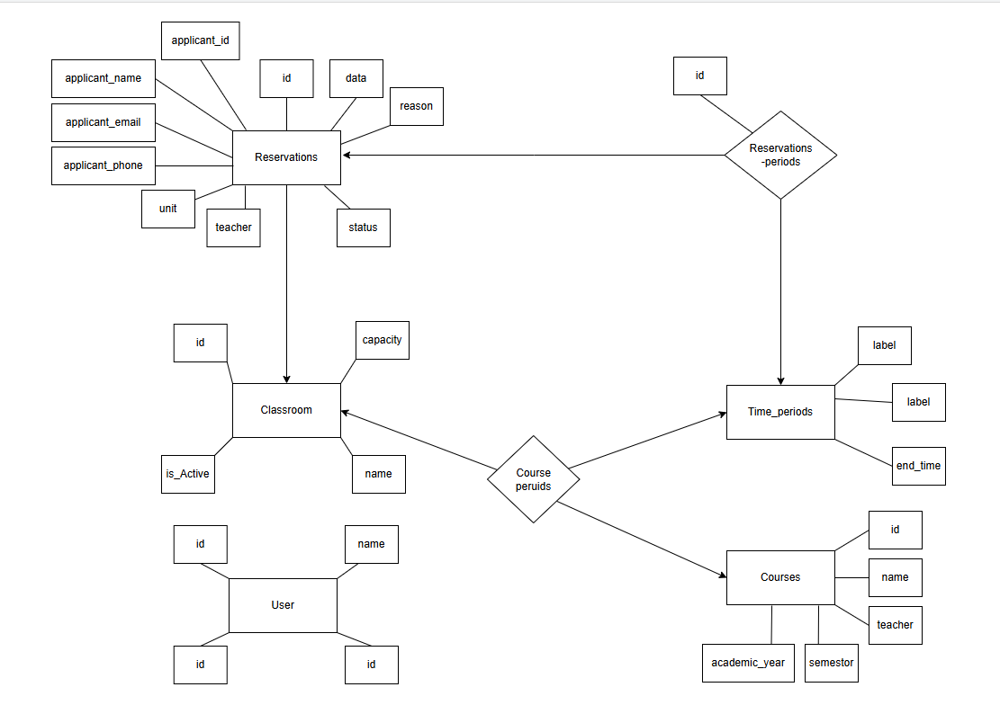
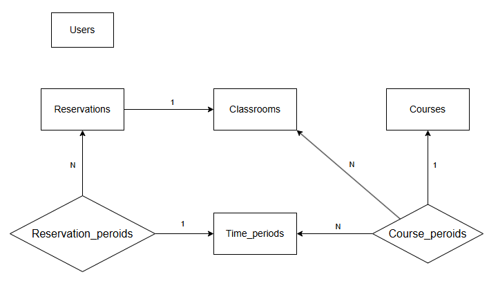
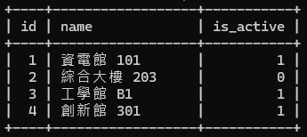
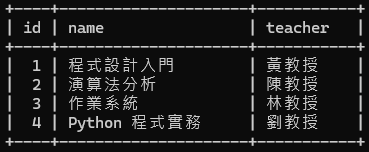
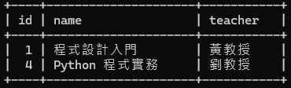
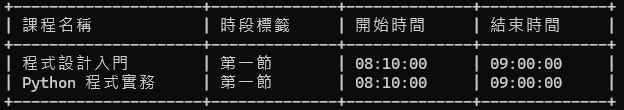

# 教室管理系統（G16）
 
## 🧩 系統簡介

本專題為「教室管理系統」，是一套具備「教室借用管理」與「使用者身份驗證」功能的 Web 應用系統，旨在改善傳統教室借用流程的效率與透明度，並提供易用且彈性的操作介面，供學生、教師與管理員使用。

系統採用模組化設計，主要拆分為以下兩大核心子系統：

- **🏫 教室借用系統（Classroom Booking System）**
  - 提供教室借用申請、查詢、審核與時段排程等功能。
  - 與 Auth Service 完整整合，依使用者角色授權操作權限。
- **🔐 身份驗證系統（Auth Service）**
   - 獨立的使用者註冊、登入與驗證模組。
   - 支援權限分級管理（如：使用者 / 管理員），確保操作安全。
   - 可作為獨立服務被其他系統整合。

---

## 👨‍💻 專案作者

| 姓名 | 學號 | 班級 | 分工 |
|------|------|------|------|
| 吳哲瑋 | 41143213 | 四資工三乙 | 整體專案PM、資料庫架構設計、子系統開發協助 |
| 李鎮宇 | 41143216 | 四資工三乙 | 身分驗證系統前端設計、後端功能開發 |
| 林致均 | 41143222 | 四資工三乙 | 教室借用系統前端設計、後端功能開發 |
| 陳亮祐 | 41143235 | 四資工三乙 | 教室借用系統前端 |

---

## 🌐 應用情境（使用說明）

在系上管理的教室，每天都有借用需求。除了課表已固定的教室外，還有許多由個人申請的借用需求。過去，這些申請通常是透過紙本方式進行，如今系上已經有一個線上借用系統，這大大提高了借用的便利性。然而，該系統在使用上仍存在一些不便之處。因此，我們希望重新設計一個符合當前需求的新系統。

---

## 🔍 使用者調查（User Research）

1. 借用人申請教室後，無法得知是否已通過申請。
2. 借用人若需更改申請時間，無法進行更改，容易造成重複占用的情況。
3. 管理員希望系統能提供通知功能，讓有借用需求時才進行審核，而不需要每天登入系統檢查。
4. 管理員目前只能新增資料，無法刪除已存在的紀錄。
5. 管理員每學期必須手動對照課表，更新已固定課表的教室借用情況。

---

## 📌 使用案例（Use Cases）

### 使用者：
1. **學生/老師**
   - 登入系統
   - 查詢教室空間
   - 提出借用申請
   - 查看審核狀態

2. **管理員**
   - 查看所有借用紀錄
   - 審核教室借用
   - 設定教室可用狀態與課程時段

---

## 📋 教室資料庫設計圖（ERD）




---

## 📎 作業連結

### 作業一：🔗 [前往作業一連結](https://www.canva.com/design/DAGj9WScB2c/AUaKssZWl7kdMSSYxcPwuw/edit?utm_content=DAGj9WScB2c&utm_campaign=designshare&utm_medium=link2&utm_source=sharebutton)

### 作業二：🔗 [前往作業二連結](https://www.canva.com/design/DAGmr2V3CzA/0mnUy8ykieZKFDUyV-0oBQ/edit?utm_content=DAGmr2V3CzA&utm_campaign=designshare&utm_medium=link2&utm_source=sharebutton)

---


## 🏫 教室借用系統（Classroom Booking System）


### 🔷 一、實體資料表（Entities）

### 1. `users` – 使用者資料表

```sql
CREATE TABLE users (
    id INT PRIMARY KEY AUTO_INCREMENT,
    name VARCHAR(100) NOT NULL,
    email VARCHAR(100) NOT NULL UNIQUE,
    role VARCHAR(50) NOT NULL CHECK (role IN ('admin', 'user'))
);
```

| 欄位名稱 | 資料型別 | 中文說明 | 是否為空值 | 完整性限制 |
|----------|-------------|----------|--------------|--------------|
| `id`     | int | 使用者編號 | 否 | 主鍵，自動產生 |
| `name`   | varchar | 使用者姓名 | 否 | NOT NULL |
| `email`  | varchar | 電子郵件 | 否 | NOT NULL, UNIQUE |
| `role`   | varchar | 使用者角色 | 否 | NOT NULL, 僅限 'admin' 或 'user' |

- ** 格式說明 **
電子郵件格式:"學號"@nfu.edu.tw

---

### 2. `classrooms` – 教室資料表

```sql
CREATE TABLE classrooms (
    id INT PRIMARY KEY AUTO_INCREMENT,
    name VARCHAR(100) NOT NULL,
    is_active BOOLEAN DEFAULT TRUE
);
```

| 欄位名稱 | 資料型別 | 中文說明 | 完整性限制 |
|----------|-------------|----------|--------------|
| `id`         | INTEGER      | 教室編號 | 主鍵，自動產生 |
| `name`       | VARCHAR(100) | 教室名稱 | NOT NULL |
| `is_active`  | BOOLEAN      | 是否啟用 | 預設為 TRUE |

---

### 3. `courses` – 課程資料表

```sql
CREATE TABLE courses (
    id INT PRIMARY KEY AUTO_INCREMENT,
    name VARCHAR(100) NOT NULL,
    teacher VARCHAR(100) NOT NULL,
    academic_year VARCHAR(20) NOT NULL,
    semester VARCHAR(10) NOT NULL CHECK (semester IN ('上', '下'))
);
```

| 欄位名稱 | 資料型別 | 中文說明 | 完整性限制 |
|----------|-------------|----------|--------------|
| `id`            | INTEGER       | 課程編號 | 主鍵，自動產生 |
| `name`          | VARCHAR(100)  | 課程名稱 | NOT NULL |
| `teacher`       | VARCHAR(100)  | 授課教師姓名 | NOT NULL |
| `academic_year` | VARCHAR(20)   | 學年度 | NOT NULL, 格式為 4 位數 |
| `semester`      | VARCHAR(10)   | 學期 | NOT NULL, 僅限 '上' 或 '下' |

---

### 4. `time_periods` – 時段資料表

```sql
CREATE TABLE time_periods (
    id INT PRIMARY KEY AUTO_INCREMENT,
    label VARCHAR(50) NOT NULL,
    start_time TIME NOT NULL,
    end_time TIME NOT NULL,
    CHECK (start_time < end_time)
);
```

| 欄位名稱 | 資料型別 | 中文說明 | 完整性限制 |
|----------|-------------|----------|--------------|
| `id`         | INTEGER      | 時段編號 | 主鍵，自動產生 |
| `label`      | VARCHAR(50)  | 時段標籤 | NOT NULL |
| `start_time` | TIME         | 開始時間 | NOT NULL |
| `end_time`   | TIME         | 結束時間 | NOT NULL，必須晚於開始時間 |

---

### 5. `reservations` – 教室借用申請表

```sql
CREATE TABLE reservations (
    id INT PRIMARY KEY AUTO_INCREMENT,
    date DATE NOT NULL,
    reason TEXT NOT NULL,
    status VARCHAR(50) NOT NULL CHECK (status IN ('pending', 'approved', 'rejected')),
    unit VARCHAR(100) NOT NULL,
    teacher VARCHAR(100) NOT NULL,
    applicant_id INT NOT NULL,
    applicant_name VARCHAR(100) NOT NULL,
    applicant_email VARCHAR(100) NOT NULL,
    applicant_phone VARCHAR(50) NOT NULL,
    classroom_id INT NOT NULL,
    FOREIGN KEY (classroom_id) REFERENCES classrooms(id)
);
```

| 欄位名稱 | 資料型別 | 中文說明 | 完整性限制 |
|----------|--------------|----------|--------------|
| `id`              | INTEGER       | 借用紀錄編號 | 主鍵，自動產生 |
| `date`            | DATE          | 借用日期 | NOT NULL |
| `reason`          | TEXT          | 借用原因 | NOT NULL |
| `status`          | VARCHAR(50)   | 借用狀態 | NOT NULL, 限定值 |
| `unit`            | VARCHAR(100)  | 申請單位 | NOT NULL |
| `teacher`         | VARCHAR(100)  | 指導老師 | NOT NULL |
| `applicant_id`    | INTEGER       | 申請人 ID | NOT NULL |
| `applicant_name`  | VARCHAR(100)  | 申請人姓名 | NOT NULL |
| `applicant_email` | VARCHAR(100)  | 申請人信箱 | NOT NULL, Email 格式 |
| `applicant_phone` | VARCHAR(50)   | 申請人電話 | NOT NULL |
| `classroom_id`    | INTEGER       | 教室 ID | 外鍵 |

**外鍵說明：**
- `classroom_id` → `classrooms(id)`

---

### 🔶 二、關係資料表（Relationships）

### 1. `course_periods` – 課程 × 時段 × 教室 的中介表

```sql
CREATE TABLE course_periods (
    id INT PRIMARY KEY AUTO_INCREMENT,
    course_id INT NOT NULL,
    time_period_id INT NOT NULL,
    classroom_id INT,
    FOREIGN KEY (course_id) REFERENCES courses(id) ON DELETE CASCADE,
    FOREIGN KEY (time_period_id) REFERENCES time_periods(id) ON DELETE CASCADE,
    FOREIGN KEY (classroom_id) REFERENCES classrooms(id) ON DELETE SET NULL
);
```

| 欄位名稱 | 資料型別 | 中文說明 | 完整性限制 |
|----------|--------------|----------|--------------|
| `id`            | INTEGER | 編號 | 主鍵，自動產生 |
| `course_id`     | INTEGER | 課程 ID | NOT NULL, 外鍵 |
| `time_period_id`| INTEGER | 時段 ID | NOT NULL, 外鍵 |
| `classroom_id`  | INTEGER | 教室 ID | 可為空, 外鍵 |

**外鍵說明：**
- `course_id` → `courses(id)`  
- `time_period_id` → `time_periods(id)`  
- `classroom_id` → `classrooms(id)`

---

### 2. `reservations_periods` – 借用申請 × 時段 的中介表

```sql
CREATE TABLE reservations_periods (
    id INT PRIMARY KEY AUTO_INCREMENT,
    reservation_id INT NOT NULL,
    time_period_id INT NOT NULL,
    FOREIGN KEY (reservation_id) REFERENCES reservations(id) ON DELETE CASCADE,
    FOREIGN KEY (time_period_id) REFERENCES time_periods(id) ON DELETE CASCADE
);
```

| 欄位名稱 | 資料型別 | 中文說明 | 完整性限制 |
|----------|--------------|----------|--------------|
| `id`              | INTEGER | 編號 | 主鍵，自動產生 |
| `reservation_id`  | INTEGER | 借用申請 ID | NOT NULL, 外鍵 |
| `time_period_id`  | INTEGER | 時段 ID | NOT NULL, 外鍵 |

**外鍵說明：**
- `reservation_id` → `reservations(id)`  
- `time_period_id` → `time_periods(id)`

---

## 📌 關係整理與解釋



- 一筆 **reservation**（借用）對應一間 **classroom**（教室）→ 多對一關係
- 一門 **course**（課程）可對應多個 **time_period**（時段）→ 多對多關係，透過 `course_periods`
- 一筆 **reservation** 可對應多個 **time_period** → 多對多關係，透過 `reservations_periods`
- **course_periods** 額外指定該時段使用的 **classroom**（教室） → 多對一關係

---

## 📊 教室管理系統 SQL 查詢需求說明

本文件整理了教室管理系統（G16）常見查詢需求與對應的 SQL 語法，適用於 MariaDB。


### 1️⃣ 查詢教室有哪些

```sql
SELECT id, name, is_active
FROM classrooms;
```

說明：列出所有教室名稱與啟用狀態。



### 2️⃣ 查詢 113-1 有哪些課程

```sql
SELECT id, name, teacher
FROM courses
WHERE academic_year = '113' AND semester = '1';
```

如果學期欄位使用「上、下」文字，請改為：

```sql
SELECT id, name, teacher
FROM courses
WHERE academic_year = '113' AND semester = '上';
```



### 3️⃣ 查詢 113-1 含「程式」的課程

```sql
SELECT id, name, teacher
FROM courses
WHERE academic_year = '113'
  AND semester = '上'
  AND name LIKE '%程式%';
```

說明：篩選學年度為 113、學期為「上」，且課程名稱包含「程式」的課程。



### 4️⃣ 查詢 113 上學期程式課在那些時段上課

```sql
SELECT 
    c.name AS 課程名稱,
    tp.label AS 時段標籤,
    tp.start_time AS 開始時間,
    tp.end_time AS 結束時間
FROM courses c
JOIN course_periods cp ON c.id = cp.course_id
JOIN time_periods tp ON cp.time_period_id = tp.id
WHERE c.academic_year = '113'
  AND c.semester = '上'
  AND c.name LIKE '%程式%';
```

說明：從 `courses`、`course_periods` 和 `time_periods` 表連接查出所有 113-上含「程式」課程的時段安排。




---

## 🔐 身份驗證系統（Auth Service）


---
